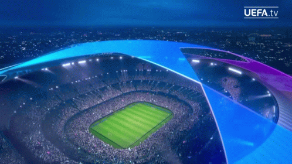

# ⚽ 23-24-Champions-League-Playing-XI

## 📌 Project Overview
* Scraped player stats from  using .
* Cleaned and organized the dataset for analysis using python.
* Visualized performance metrics and made an interactive dashboard on Tableau.
* Compared players across positions using stats like goals, assists, xG, key passes, tackles, interceptions, saves etc
* Selected a data-driven Best XI for the season.

## 🛠️ Tools & Technologies
* Python (Pandas)
* Visualization tool : Tableau

## 📊 Dataset Description
* datatable : Contains all the shooting stats (Goals, Xg, Non-penalty Xg etc).
* fbref_creation : Contains all the creativity and creation metrics (Shot creating Actions, Goal Creating Actions).
* fbref_def : Contains all the defensive stats (Tackles, Interceptions etc).
* fbref_passing : Contains all the passing metrics (Assists, Pass completion etc).
* fbref_possession : Contains all the possession stats (touches, takeons, carries).
* fbref_misc : Contains some miscellaneous stats (red card, yellow card, aerial duels etc).
* fbref_goalk : Contains standard goalkeeper stats (saves, goals conceeded).
* fbref_goalka : Contains advanced goalkeeping stats (crosses saved, passes, expected saves).
